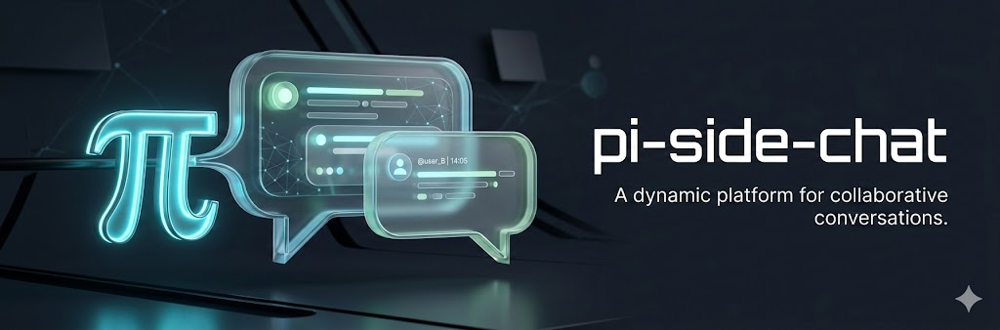

<p>
  
</p>

# pi-side-chat

Fork your conversation into an independent side chat while the main agent keeps working.

```
┌─────────────────────────────────────────────────────────────────┐
│ Side Chat                        [Main: idle] [Read]          │
├─────────────────────────────────────────────────────────────────┤
│                                                                 │
│ [You]: What's the difference between Effect and Promise?       │
│                                                                 │
│ [Assistant]: Effect is a lazy, composable description of a     │
│ computation that may fail, require dependencies, or perform    │
│ side effects. Unlike Promises which execute immediately...     │
│                                                                 │
├─────────────────────────────────────────────────────────────────┤
│ > _                                                             │
├─────────────────────────────────────────────────────────────────┤
│ Esc close · Enter send · Shift+↑/↓ scroll · Alt+/ main · Ctrl+T edit │
└─────────────────────────────────────────────────────────────────┘
```

## Why

You're deep in a refactoring task when you need to check something quick — "wait, does this API support streaming?" or "what's the syntax for that Jest matcher again?"

Without side chat, you either:
- Interrupt your main agent mid-task (losing momentum)
- Open a new terminal and start a fresh pi session (losing context)
- Context-switch to a browser (losing focus)

Side chat lets you fork the current conversation into an overlay. Ask your quick question, get your answer, close the overlay. Main agent never stopped working.

## Install

The extension is already in `~/.pi/agent/extensions/pi-side-chat/`. Just restart pi.

## Quick Start

**Open side chat:**
- Press `Alt+/`, or
- Type `/side`

**Ask your question** and press Enter.

**Close** with `Esc` when done.

That's it. The main agent continues working in the background.

## Features

### Focus Switching

Side chat opens as a non-capturing overlay. Press `Alt+/` to toggle focus between side chat and main editor. Type in main while side chat stays visible. The border dims when unfocused.

### Full Tool Access

Side chat starts in read-only mode, but it can switch to the same full tool set as the main agent. Use it for quick questions by default, then toggle into edit mode when you actually need write access.

### Smart Overlap Warnings

If you try to modify a file the main agent has written to, you'll see a warning:

```
File Overlap

Main agent has MODIFIED this file:
  src/api/handler.ts

Editing may cause conflicts or overwrite main's changes.

Proceed anyway?
```

This prevents accidental conflicts. If you know what you're doing, proceed. If not, wait for the main agent to finish.

### Tool Mode Toggle

Side chat starts in **read-only mode** by default — safer for quick questions.

Press `Ctrl+T` to switch between:
- **Read-only mode** — read-only tools only, no file modifications (default)
- **Full mode** — all tools available including write/edit

The footer shows what `Ctrl+T` will switch to: "Ctrl+T edit" or "Ctrl+T read-only".

### Forked Context

Side chat starts with a copy of your current conversation. The agent knows what you've been working on. But changes in side chat don't affect the main conversation — it's a true fork.

### Peek at Main Agent

The side chat has a special `peek_main` tool that lets it see what the main agent is doing in real-time. When you ask "what's the main agent working on?" or "show me main's progress", the side agent will use this tool to fetch and summarize recent activity.

```
You: What's the main agent doing right now?

[peek_main]

The main agent is currently refactoring the authentication module.
It just finished reading src/auth/handler.ts and is now editing
src/auth/middleware.ts to add rate limiting...
```

You can also ask for activity since you opened the side chat:

```
You: What has the main agent done since I opened this?
```

## Keyboard Shortcuts

| Key | Action |
|-----|--------|
| `Alt+/` | Open side chat / toggle focus between side chat and main |
| `Esc` | Close side chat |
| `Enter` | Send message |
| `Ctrl+T` | Toggle full/read-only mode |
| `PgUp` / `Shift+↑` | Scroll up |
| `PgDn` / `Shift+↓` | Scroll down |

**Focus switching:** When side chat is open, `Alt+/` toggles focus between side chat and main editor. You can type in main while side chat remains visible, then switch back.

## Commands

| Command | Description |
|---------|-------------|
| `/side` | Open side chat (same as Alt+/) |

## How It Works

When you open side chat:

1. **Fork context** — Current messages are deep-cloned (JSON round-trip)
2. **Create agent** — A new Agent instance with forked messages and wrapped tools
3. **Track activity** — Main agent's file operations are tracked via `tool_execution_start` events
4. **Wrap tools** — Side chat's write tools check for overlap before executing
5. **Add peek_main** — Special tool that reads live data from main session
6. **Show overlay** — TUI overlay with message display, editor, and controls

The side chat agent is fully independent. It has its own streaming state, tool execution, and message history. The main agent keeps working — you'll see "[Main: N files]" in the header showing how many files it's touched. The side agent can use `peek_main` to see what the main agent is currently doing.

## Architecture

```
Main Agent ──tool_execution_start──► FileActivityTracker (Set of written paths)
                                              │
SessionManager ◄───────────────────┐          │
       │                           │          │
       │ (live read via peek_main) │          ▼
       │                     ┌─────┴──────────────────┐
       └────────────────────►│    SideChatOverlay     │
                             │  ┌─────────┐ ┌──────┐  │
                             │  │  Agent  │ │Editor│  │
                             │  └────┬────┘ └──────┘  │
                             │       ▼                │
                             │  SideChatMessages      │
                             └────────────────────────┘
```

## File Structure

```
~/.pi/agent/extensions/pi-side-chat/
├── index.ts               # Extension entry, registers shortcut + command
├── side-chat-overlay.ts   # Overlay UI, Agent instance, peek_main tool
├── side-chat-messages.ts  # Scrollable message display
├── file-activity-tracker.ts  # Tracks files main has written (Set-based)
├── tool-wrapper.ts        # Wraps write tools with overlap check
└── README.md
```

~770 lines of TypeScript total.

## Limitations

- **Single side chat** — Only one side chat at a time. Close it before opening another.
- **No overlay stacking** — If another visible overlay is open, side chat won't open until you close or background it.
- **Ephemeral** — Side chat conversations aren't saved. When you close the overlay, it's gone.
- **No merge back** — Changes in side chat don't merge into main conversation history.
- **Bash heuristics** — Overlap detection for bash commands uses regex patterns. It catches `rm`, `cp`, `mv`, `touch`, `tee`, and redirects, but not every possible file operation (e.g., `sed -i`, Python file writes).
- **Peek is on-demand** — The `peek_main` tool fetches main agent activity when called, not continuously. For real-time streaming of main's output, you'd need to watch the main terminal.

## Configuration

Create `~/.pi/agent/extensions/pi-side-chat/config.json`:

```json
{
  "shortcut": "alt+/"
}
```

**Options:**

| Key | Default | Description |
|-----|---------|-------------|
| `shortcut` | `"alt+/"` | Keyboard shortcut to open/toggle side chat |

Shortcut format: `ctrl+shift+x`, `alt+/`, `ctrl+k`, etc. Restart pi after changing.
