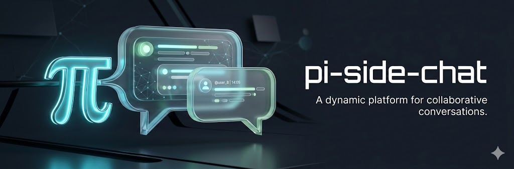

<p>
  
</p>

# pi-side-chat

> Modified fork of [nicobailon/pi-side-chat](https://github.com/nicobailon/pi-side-chat) — original by **Nico Bailon**, modifications by **yceachan**.

**Fork the current conversation into a side chat while the main agent keeps working.**

[](https://www.npmjs.com/package/pi-side-chat)
[](LICENSE)

```bash
pi install npm:pi-side-chat
```

<https://github.com/user-attachments/assets/3a359f47-c706-46b9-8b16-d05f430d402c>

You're in the middle of a longer task and want to ask something small without derailing the main thread — check an API detail, sanity-check an approach, search something, or peek at what the main agent is doing. Open the overlay, ask, close it. Main thread never gets interrupted.

## Quick Start

Open side chat with `Alt+/`, `/side` or `/btw`. Ask a question and press `Enter`.

Press `Esc` to close it. Reopen with `Alt+/` to continue where you left off.

**Toggle focus** — `Alt+/` switches between the side chat and main editor without closing the overlay.

**Background it** — `Alt+Q` sends the side chat to the background (hidden) without interrupting what it's doing; press `Alt+Q` again in the main session to bring it back. The side agent keeps streaming while hidden.

**Toggle mode** — `Ctrl+T` switches between read-only and edit mode.

**Start fresh** — `Alt+R` re-forks from the latest main context. `Alt+N` starts a blank conversation.

**Export the transcript** — `Alt+E` dumps the btw chat history (forked context, framing block and conversation) to `$CWD/.agents/eval/pi-side-chat-<timestamp>.md` as a markdown diagnostic artifact, useful for debugging feature work.

## Features

**Forks the conversation** — Starts with a copy of the current branch context. All extension tools (web_search, fetch_content, etc.) are available. Does not write back to the main conversation history.

**Persists across close/reopen** — Closing preserves the conversation. Reopening restores it. Use `Alt+R` or `Alt+N` to explicitly start fresh.

**Read-only by default** — Safe for quick questions and code reading. Toggle to edit mode when you need write access.

| Mode | Tools |
|------|-------|
| Read-only | read, grep, find, ls |
| Edit | read, bash, edit, write (with overlap warnings) |

**File overlap warnings** — If the side chat tries to modify a file the main agent has touched, it asks before proceeding.

**Peek at the main agent** — The `peek_main` tool reads recent activity from the main session.

```text
What is the main agent doing right now?
What changed since I opened this side chat?
```

**Non-capturing overlay** — Leave it visible and switch focus back to the main editor. Opens at the top of the screen so the main editor stays visible underneath.

**Taller chat area** — The message area is ~2.5x taller than before so long answers and tool output stay readable, and it adapts to small terminals (never overflows, always leaves the main editor visible).

**Scroll the history** — `PgUp`/`PgDn` scroll by a page, `Shift+↑`/`Shift+↓` by a few lines, and the mouse wheel scrolls when the pointer is over the chat. A `[↑N]` indicator appears in the header and the hint bar switches to `PgDn/Wheel ↓ latest` whenever you're scrolled away from the latest message.

## Controls

| Key | Action |
| ----- | -------- |
| `Alt+/` | Open side chat / toggle focus |
| `Alt+Q` | Background the side chat (keeps it running) / restore from main |
| `Enter` | Send message |
| `Esc` | Interrupt streaming, or close when idle |
| `Alt+R` | Re-fork from latest main context |
| `Alt+N` | Start empty conversation |
| `Alt+E` | Export the btw chat history to `$CWD/.agents/eval/pi-side-chat-<timestamp>.md` |
| `Ctrl+T` | Toggle read-only / edit mode |
| `PgUp` / `PgDn` | Scroll history by a page |
| `Shift+↑` / `Shift+↓` | Scroll by a few lines |
| Mouse wheel | Scroll when the pointer is over the chat |

## Command Reference

### `/side`

Opens the side chat overlay.

### `/btw`

Alias for `/side` — opens the side chat overlay.

### `peek_main`

Available to the side agent only.

| Param | Type | Description |
|-------|------|-------------|
| `lines` | integer | Max items to inspect (default: 20, max: 50) |
| `since_fork` | boolean | Only show activity after the side chat was opened |

## Configuration

Create a `config.json` next to the extension to change the shortcut:

```json
{
  "shortcut": "alt+/"
}
```

## How It Works

The extension clones the current session context, creates a separate agent instance with all extension-registered tools, and renders it in a TUI overlay. Closing saves the conversation in memory so reopening restores it. Backgrounding (`Alt+Q`) hides the overlay via the TUI's overlay handle while the agent keeps running.

Main-agent tool execution events are tracked to maintain a set of written file paths. In edit mode, write-capable tools are wrapped to warn before touching those paths.

While the side chat is open, xterm mouse reporting (SGR) is enabled and wheel events over the overlay are routed to the chat scroll; they are consumed so they never leak into the editor. Mouse reporting is disabled again when the side chat closes.

`peek_main` reads the current session branch on demand and returns a compact summary.

## Limitations

- One side chat at a time
- Won't open on top of another visible overlay
- Does not merge messages back into the main thread
- Bash overlap detection is heuristic — catches common write patterns, not all
- `peek_main` is on-demand, not live
